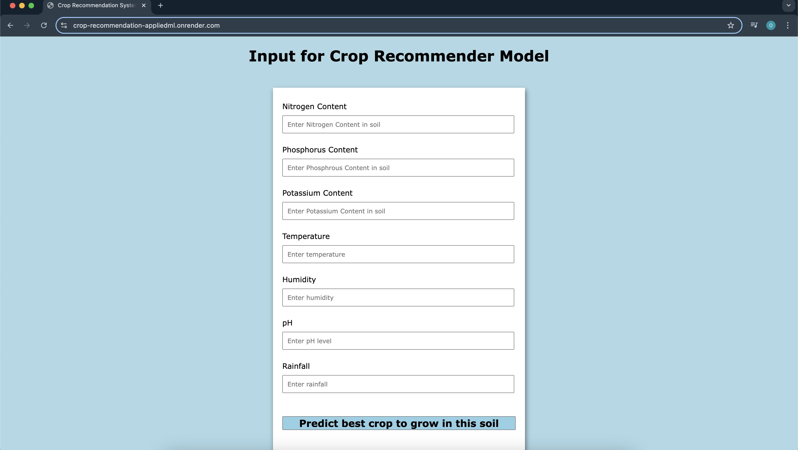
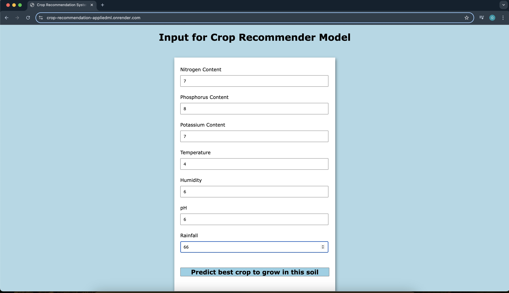
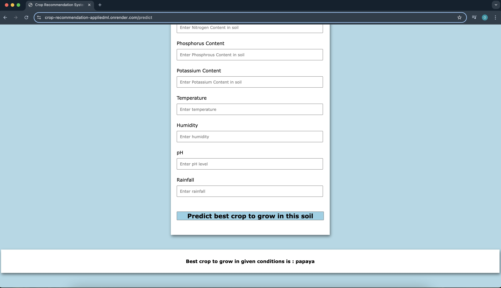

A Crop Recommender Model using Gaussian Naive Bayes algorithm and flask library for deployment

#### Deployment Link - https://crop-recommendation-appliedml.onrender.com/

### The Base UI of our model

### Enter values in the form and press the submit button

### Find the prediction at the bottom of the screen

